# Capstone Design Project TEAM3

## My Health Data

This application demonstrates managing an exercise experience using the `ExerciseClient` API.

> **Overview**
> > It displays health data that changes according to the movement of the app user at once. \
> > You can click on the desired biometric data to view only one item. \
> > If the exercise function is not available, an error message is displayed.
> > 
> **Application Features**
> > **Measurement data**
> > >**Heart rate**\
> > >Current heart rate, in beats per minute.
> > >
> > >**Calories burned**\
> > >Number of calories burned (including basal rate and activity).
> > >
> > >**Distance**\
> > >A distance delta between each reading expressed in meters.
> > >
> > >**Laps**\
> > >Count of laps since the start of the current active exercise.
> > >
> > >**Speed**\
> > >Speed at a specific point in time, expressed as kilometers/hour.
> > >
> > **Additional function**
> > >When each data item is pressed, only the corresponding item is displayed.

### Running the application

You will need a Wear device or emulator with Health Services installed. \
Open the project in Android Studio and launch the app on your device or emulator.

On startup, the app checks the device capabilities. \
Press the START button when the confirmation is complete.

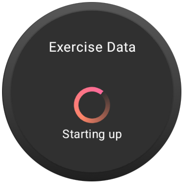
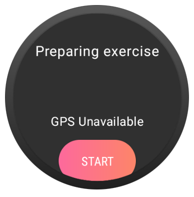

If the necessary exercise capabilities are available, you will see a screen like this:

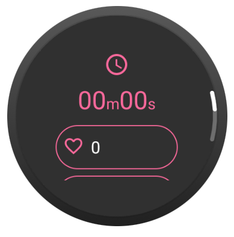
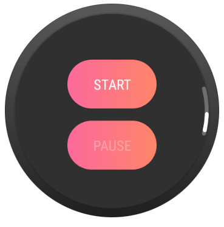

When you press start, the app configures a running exercise and starts it. (You may need to use the
[synthetic data provider](#using-synthetic-data) so that Health Services doesn't immediately pause
the exercise due to no user activity.) While the exercise is active, the UI will show the exercise
duration, heart rate bpm, calories burned, distance traveled, the number of laps and the speed. To mark a lap,
press one of the hardware buttons around the watch frame.

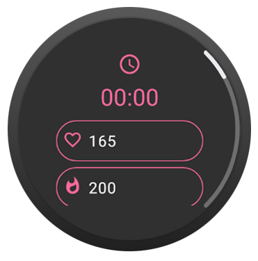
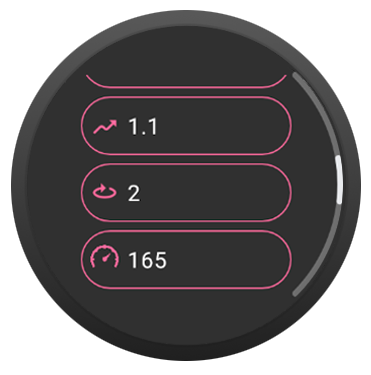

Click on each data item to view one piece of information at a time.

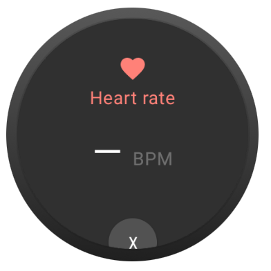

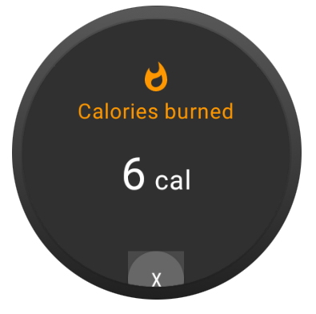

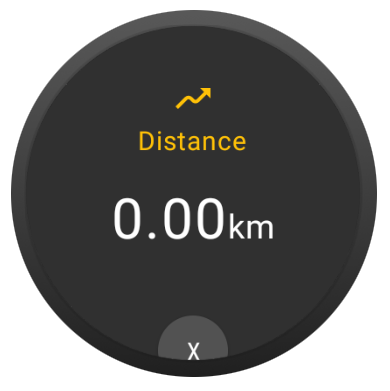

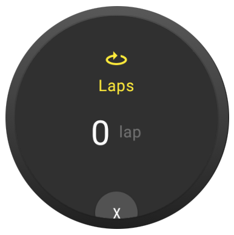

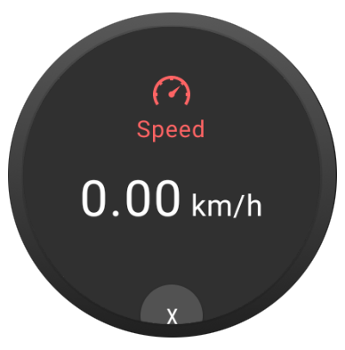

While an exercise is in progress, if you leave the app, an ongoing notification appears, offering
quick return to the exercise screen.

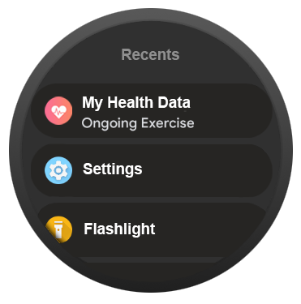

On devices where the exercise capability is not available, you will see a screen like this:

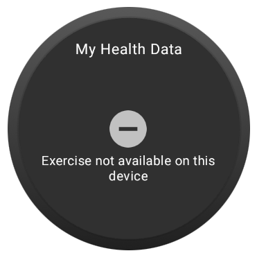

### Using synthetic data

To make Health Services use a synthetic data provider instead of real sensors, run the following
command:

```shell
adb shell am broadcast \
-a "whs.USE_SYNTHETIC_PROVIDERS" \
com.google.android.wearable.healthservices
```

Then, to simulate the user is running:

```git exclude
adb shell am broadcast \
-a "whs.synthetic.user.START_RUNNING" \
com.google.android.wearable.healthservices
```

To stop using the synthetic provider, run this command:
```shell
adb shell am broadcast -a \
"whs.USE_SENSOR_PROVIDERS" \
com.google.android.wearable.healthservices
```
